# DASP LAB EXPERIMENTS

# 1. AIM:  WRITE A MATLAB PROGRAM TO FIND THE CIRCULAR CONVOLUTION OF TWO DISCRETE SIGNALS. 
# THEORY:
The circular convolution, also known as cyclic convolution, of two aperiodic functions (i.e. Schwartz functions) occurs when one of them is convolved in the normal way with a periodic summation of the other function. That situation arises in the context of the circular convolution theorem. The identical operation can also be expressed in terms of the periodic summations of both functions. That situation arises in the context of the discretetime Fourier transform (DTFT) and is also called periodic convolution. In particular, the DTFT of the product of two discrete sequences is the periodic convolution of the DTFTs of the individual sequences. And each DTFT is a periodic summation of a continuous Fourier transform function. Circular convolution utilises the periodicity of samples in DFT and hence gives the result efficiently. But as we require the output we get by linear convolution, we padd the input or impulse response whatever is short with zeros called zero padding. 

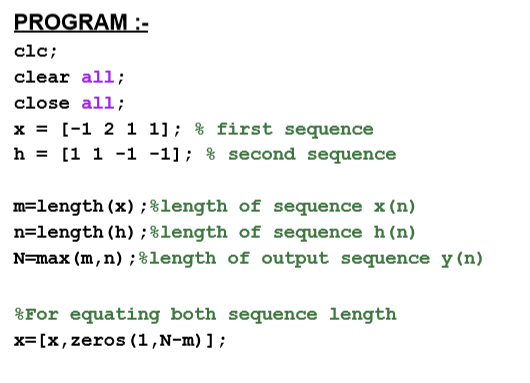
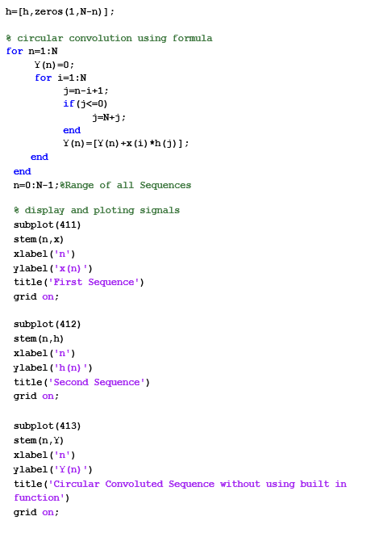
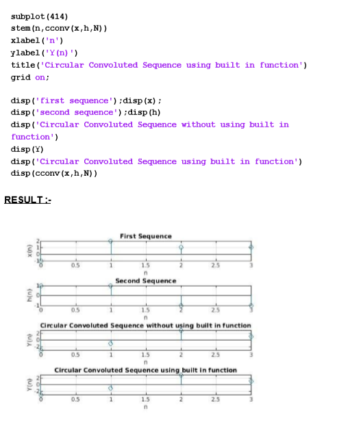
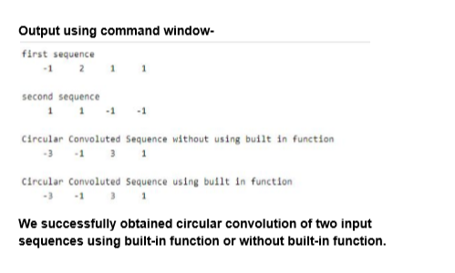

# 2. AIM:  Write a MATLAB program to find DFT & IDFT of a discrete signal using FFT algorithm. 
# THEORY:
A fast Fourier transform (FFT) is an algorithm that computes the discrete Fourier transform (DFT) of a sequence, or its inverse (IDFT). Fourier analysis converts a signal from its original domain (often time or space) to a representation in the frequency domain and vice versa. Some of the important applications of the FFT include: Fast largeinteger and polynomial multiplication. Efficient matrix-vector multiplication for Toeplitz, circulant and other structured matrices. Filtering algorithms (see overlap-add and overlap-save methods). 
 

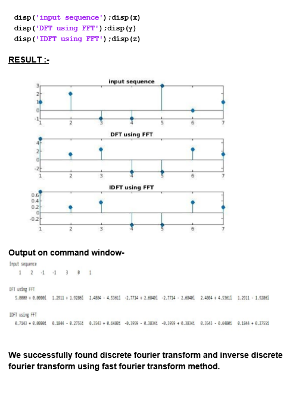
 
 # 3. AIM: Write a MATLAB program to find the Z-transform of various standard discrete signals.
 # THEORY:
In mathematics and signal processing, the Z-transform converts a discrete time signal, which is a sequence of real or complex numbers, into a complex frequencydomain representation. It can be considered as a discrete-time equivalent of the Laplace transform. The Z-transform can be defined as either a one-sided or two-sided transform. 
 
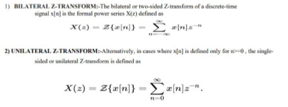
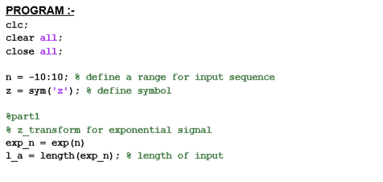
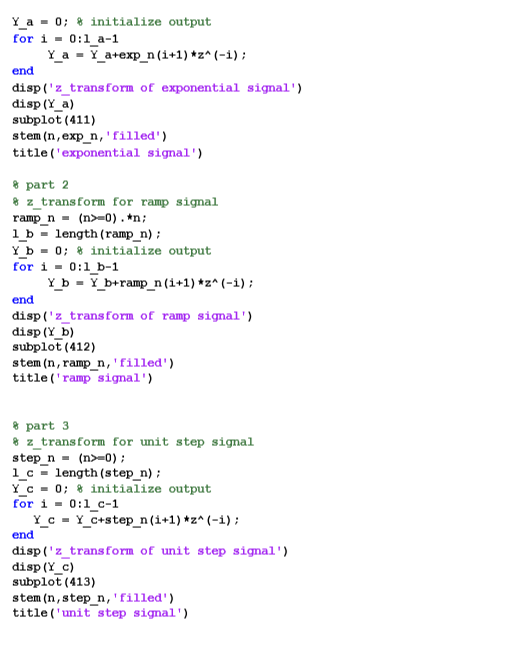
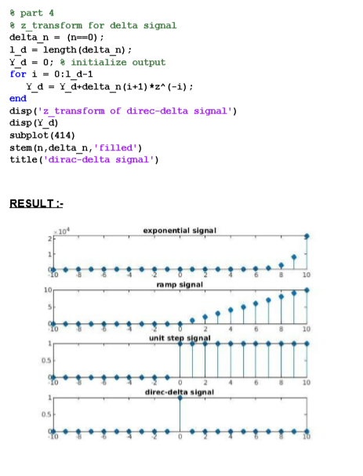
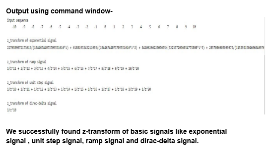

# 4. AIM: To plot the magnitude and phase spectrum of FIR filters (LPF, HPF, BPF, and BSF) using a MATLAB program.
# THEORY:
Finite Impulse Response (FIR) filter can be designed by various techniques. The widely used technique is the window technique. In this various types of FIR filter are implemented using an efficient adjustable window function based on Hamming window. Finite-duration impulse response (FIR) digital filter, the operation is governed by linear constant-coefficient difference equations of a non-recursive nature. A Finite- duration Impulse Response (FIR) filter is a filter structure that can be used to implement almost any sort of frequency response digitally. An FIR filter is usually implemented by using a series of delay, multipliers and adder to create the filter’s output. The transfer function of FIR digital filter is a polynomial in z inverse.

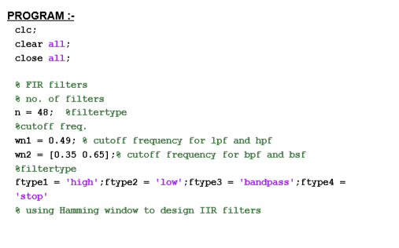
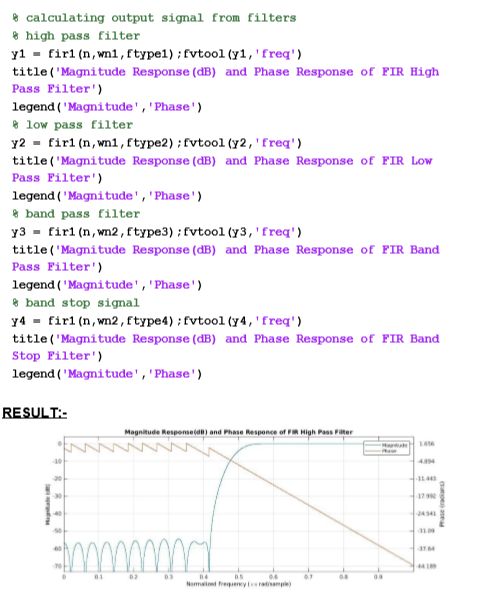
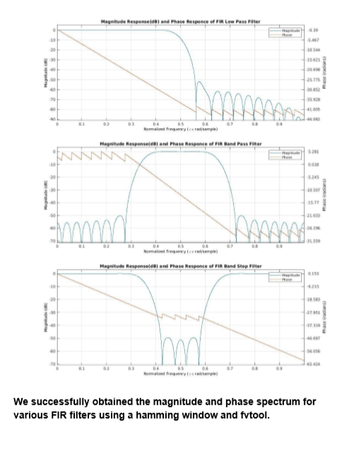

# 5. AIM: To plot magnitude and phase spectrum for IIR filters (LPF/HPF/BPF/BSF) using MATLAB.
# THEORY: 
The Butterworth filter is a type of signal processing filter designed to have a frequency response as flat as possible in the passband. It is also referred to as a maximally flat magnitude filter. The frequency response of the Butterworth filter is maximally flat (i.e. has no ripples) in the passband and rolls off towards zero in the stopband. 

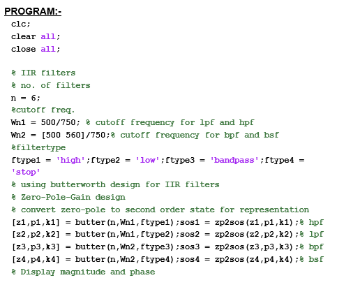
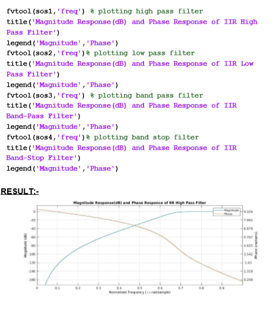
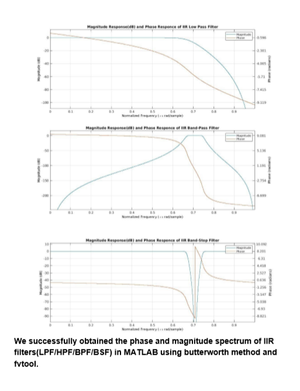

# CREDITS -->
# The project is the combined effort of:
# DEEP RANJAN(17MI416)
# HARIT YADAV(17MI418) 
# DIVYANSHU BHAIK(17MI446) 

# ………………………………… THANK   YOU   ………………………………………
