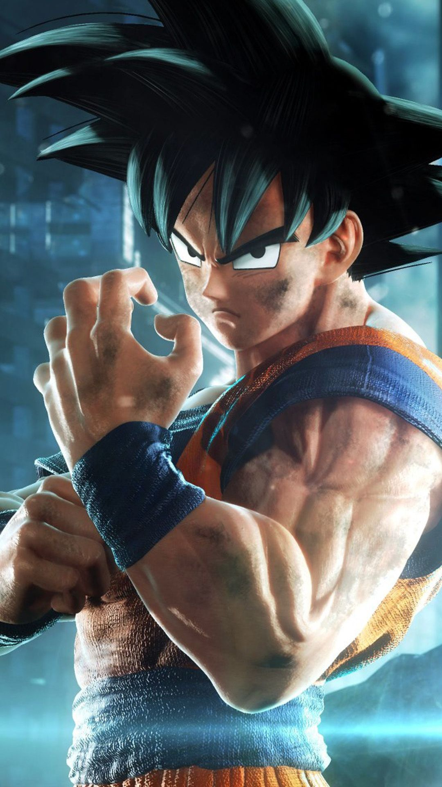
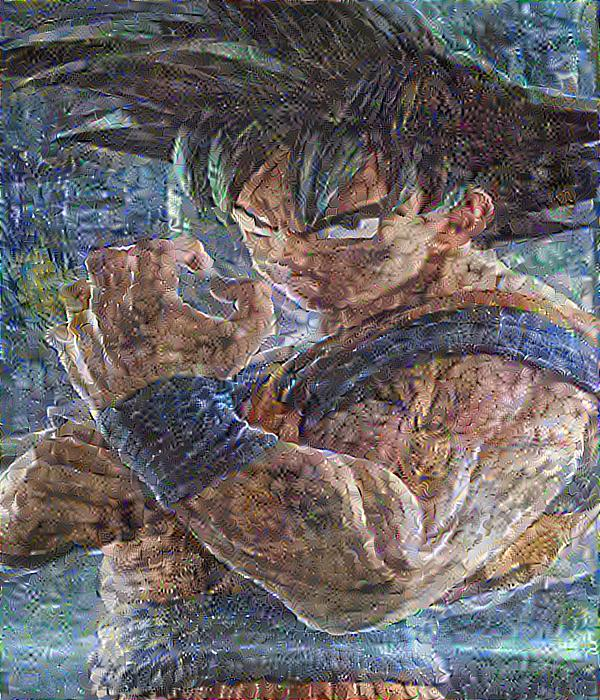

This file contains the implementation of Neural Style Transfer algorithm.

**Requirements:**

1. tensorflow
2. matplotlib
3. skimage
4. numpy
5. tqdm
6. scipy

**Use:**
Run the "Neural_Style_Transfer.py" python file and the algorithm will start working.

**Results:**

Content Image:

Style Iamge:

Generated Image:

